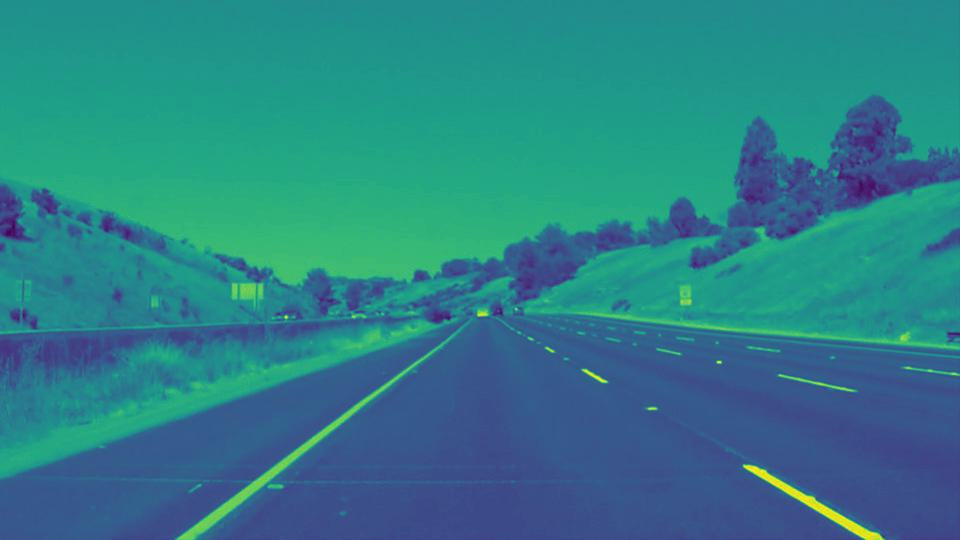

# Finding Lane Lines on the Road 

In this project, lane line of the road identified using Python and OpenCV. A pipeline is created to test the result initially on images and later applied the results to video stream (series of images).
<br />

<br />
Raw input image of a road.

<br />

<br />
Output Image with identified lane lines.

## Overview

---

### 1. Description of pipeline for images.

The pipeline for image consist of 11 steps-

#### Step 1. Read test_image.
Read the image of the road whose lane line is needed to be detected

```python
#reading an image
image = mpimg.imread('test_images/whiteCarLaneSwitch.jpg')

#printing out its type, dimensions and plotting it
print('This image is:', type(image), 'with dimensions:', image.shape)
plt.imshow(image)  # if you wanted to show a single color channel image called 'gray', for example, call as plt.imshow(gray, cmap='gray')
```


<br />

#### Step 2. Convert image to grayscale

`grayscale()` function is used to convert the test_image to the grayscaled image. This function uses the `cv2.cvtColor()` opencv function which convert images from one color space to another.

```python
#show the grayscaled image
gray = grayscale(image)
plt.imshow(gray, cmap='gray')
```


<br />

#### Step 3. Convert image to HSV color space

`hsvscale()` function is defined to convert the test_image to the HSV (Hue, Saturation, and Value) color space. This function uses the `cv2.cvtColor()` opencv function which convert images from one color space to another.

```python
#show the grayscaled image
hsv_img = hsvscale(image)
plt.imshow(hsv_img)
```


<br />

#### Step 4. Extract yellow and white parts from the HSV image

Upper and lower range for the lane color (here, yellow and white) is defiined. With use of opencv function `cv2.inRange()`, yellow and white part within defined range extracted from the hsv image. `cv2.bitwise_or` function is used to combine both extracted images like logical 'OR' operation.

```python
#range of color in HSV image
lower_range_y = np.array([20,100,100])
upper_range_y = np.array([30,255,255])
lower_range_w = np.array([0,0,235])
upper_range_w = np.array([255,255,255])

# extract yellow and white part from the image
yellow_part = cv2.inRange(hsv_img, lower_range_y, upper_range_y)
white_part = cv2. inRange(hsv_img, lower_range_w, upper_range_w)

# masking both extracted images
whole_mask = cv2.bitwise_or(yellow_part, white_part)
plt.imshow(whole_mask)
```


<br />

#### Step 5. Halving the brightness of the gray image

Dividing the pixel values of a grayscale image (gray) by 2 and then converting the resulting array to the data type uint8. This operation will reduce the overall brightness of the image by half.

```python
# brightness reduction of gray image 
lower_brightness_gray = (gray / 2).astype('uint8')
plt.imshow(lower_brightness_gray)
```


<br />

#### Step 6. Combine the result of step 4 and step 5 (boosted image)

The `bitwise_or()` operation combines the two images so that the resulting image has the lane line highlighted on the darker image background. By applying the 'whole_mask' on top of the 'lower_brightness_gray' image, the lane line is emphasized and made more visible, while the rest of the image remains darkened.

```python
#boosted image 
boost_lane = cv2.bitwise_or(lower_brightness_gray, whole_mask)
plt.imshow(boost_lane)
```


<br />

#### Step 7. Gaussian blurring of boosted image

`gaussian_blur()` function is used to blur the input image. This function uses the `cv2.GaussianBlur()` opencv function which reduce image noise and smooth out details in an image.

```python
#gaussian blur
blur_img = gaussian_blur(boost_lane, 5)
plt.imshow(blur_img)
```


<br />

#### Step 8. Show the edges image

`canny()` function is used to convert input image to edges image. Here it uses the `cv2.canny()` opencv function which returns a binary image with white pixels tracing out the detected edges and black everywhere else.

```python  

# canny edge detection apply
edges = canny(blur_img, 60, 150)
plt.imshow(edges)
```

<br />

#### Step 9. Region masking

The `region_of_interest()` function is used to mask a area according to your desired shape in a image. Here we have used a quardilateral shaped masking region with following vertices.

```python
# masked edges 
vertices = np.array([[(0, 540), (450,315), (500,315), (960,540)]], dtype=np.int32)
masked_edges = region_of_interest(edges, vertices)
plt.imshow(masked_edges)
```

<br />

#### Step 10. Run Hough on edge detected image with Line Extrapolation

```python
rho = 3 # distance resolution in pixels of the Hough grid
theta =  np.pi/180 # angular resolution in radians of the Hough grid
threshold = 40     # minimum number of votes (intersections in Hough grid cell)
min_line_len = 70 #minimum number of pixels making up a line
max_line_gap = 250    # maximum gap in pixels between connectable line segments

# Run Hough on edge detected image
color_edges = hough_lines(masked_edges, rho, theta, threshold, min_line_len, max_line_gap)
plt.imshow(color_edges)
```

In order to draw a single line for the left and right lane the `draw_line()` function has been modified (line extrapolaion) to -

```python
def draw_lines(img, lines, color=[255, 0, 0], thickness=2):
   
    slope_lines = []
    intercept_lines = []
    slope_left = []
    slope_right = []
    intercept_left = []
    intercept_right = []
    img_x_size = img.shape[1]
    img_y_size = img.shape[0]
    slope_left_sign = []
    slope_right_sign = []

    # slopes and intercept of all lines
    
    for line in lines:
        for x1, y1, x2, y2 in line:
            slope_ind = (y2-y1)/(x2-x1) 
            intercept_ind = y1 - x1 * ((y2-y1)/(x2-x1))
            slope_lines.append(slope_ind)
            intercept_lines.append(intercept_ind) 

    for val in slope_lines:
        if val < 0:
            slope_left_sign.append(val)
        else:
            slope_right_sign.append(val)

    mean_slope_left = np.mean(slope_left_sign)
    std_slope_left = np.std(slope_left_sign)
    mean_slope_right = np.mean(slope_right_sign)
    std_slope_right = np.std(slope_right_sign)
    
    for s,i in zip(slope_lines, intercept_lines):
        if abs(s-mean_slope_left) < std_slope_left: 
            slope_left.append(s)
            intercept_left.append(i)
        elif abs(s-mean_slope_right) < std_slope_right:
            slope_right.append(s)
            intercept_right.append(i)

    if len(slope_left) > 0:
        left_line_para = [sum(slope_left)/len(slope_left), sum(intercept_left)/len(intercept_left)]
        left_y1 = int(img_y_size)
        left_x1 = int((left_y1 - left_line_para[1])/ left_line_para[0])
        left_y2 = int(img_y_size * 0.580)
        left_x2 = int((left_y2 - left_line_para[1])/ left_line_para[0])
        cv2.line(img, (left_x1, left_y1), (left_x2, left_y2), color, 10)

    if len(slope_right) > 0:
        right_line_para = [sum(slope_right)/len(slope_right), sum(intercept_right)/len(intercept_right)]
        right_y1 = int(img_y_size)
        right_x1 = int((right_y1 - right_line_para[1])/ right_line_para[0])
        right_y2 = int(img_y_size * 0.580)
        right_x2 = int((right_y2 - right_line_para[1])/ right_line_para[0])
        cv2.line(img, (right_x1, right_y1), (right_x2, right_y2), color, 10)
 
```

After modifying `draw_line()`, the output of `hough_lines()` as 


<br />

#### Step 11. Show lines on raw image

`Weighted_img()` uses the `cv2.addWeighted()` opencv function which returns the added weighted sum of the array of two images i.e line image and raw image.

```python
# drawing line on edges image
line_edge =  weighted_img(color_edges, image)
plt.imshow(line_edge)
mpimg.imsave('test_images_output/whiteCarLaneSwitch.jpg', line_edge)
```

<br />


### 2. Implementation of pipeline for videos.

The pipeline for video contain one step-

#### Call all the defined function 

```python
ef process_image(image):

    #gray scale conversion
    gray = grayscale(image)

    #hsv image
    hsv_img = hsvscale(image)

    #range of color in HSV image
    lower_range_y = np.array([20,100,100])
    upper_range_y = np.array([30,255,255])
    lower_range_w = np.array([0,0,235])
    upper_range_w = np.array([255,255,255])

    # extract yellow and white part from the image
    yellow_part = cv2.inRange(hsv_img, lower_range_y, upper_range_y)
    white_part = cv2. inRange(hsv_img, lower_range_w, upper_range_w)
    whole_mask = cv2.bitwise_or(yellow_part, white_part)

    # brightness reduction of gray image 
    lower_brightness_gray = (gray / 2).astype('uint8')

    #boosted image 
    boost_lane = cv2.bitwise_or(lower_brightness_gray, whole_mask)

    #gaussian blur
    blur_img = gaussian_blur(boost_lane, 5)

    # canny edge detection apply
    edges = canny(blur_img, 60, 150)

    # masked edges 
    vertices = np.array([[(50, 540), (460,310), (500,310), (960,540)]], dtype=np.int32)
    masked_edges = region_of_interest(edges, vertices)

    # hough lines
    color_edges = hough_lines(masked_edges, 3, np.pi/180, 40, 70,250)
    # hough_lines(img, rho, theta, threshold, min_line_len, max_line_gap)

    # drawing line on edges image
    result =  weighted_img(color_edges, image)
    
    return result
```
